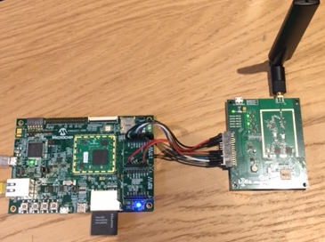
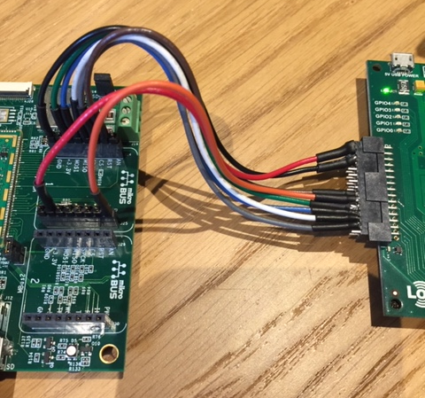

# Microchip SAMA5 Buildroot External Lora

This [buildroot external][1] includes Microchip packages, patches, setup, and
configuration to create a Lora getway and packet forwarder on the SAMA5.
It uses the Lora-Net/lora_gateway and the Lora-Net/packet_forwarder packages
found on github. Custom patches are provided in this BR2 external tree to patch
the Lora-Net packages allowing compilation for the SAMA5 SOM1-EK1 board.

This project provides an extension to buildroot to support these customizations
outside of the standard buildroot tree.

For a description of the hardware configuration see [here](#Hardware)

For a description of the gateway software configuration see [here](#Packet-Gateway-Setup)
## Install System Dependencies

The external is tested on Ubuntu 16.04 LTS.  The following system build
dependencies are required.

    sudo apt-get install subversion build-essential bison flex gettext \
    libncurses5-dev texinfo autoconf automake libtool mercurial git-core \
    gperf gawk expat curl cvs libexpat-dev bzr unzip bc python-dev

In some cases, buildroot will notify that additional host dependencies are
required.  It will let you know what those are.

## Buildroot Dependencies

Many of the demo applications included in this external depend on Qt 5.9 or
later.  This buildroot external requires a new version of buildroot equal to or
greater than 2018.02-at91.


## Build

Clone, configure, and build.  When building, use the appropriate defconfig in
the `buildroot-external-microchip/configs` directory for your board.

    git clone https://github.com/cybdarren/buildroot-external-lora.git
    git clone https://github.com/linux4sam/buildroot-at91.git -b 2018.02-at91
    cd buildroot-at91
    BR2_EXTERNAL=../buildroot-external-lora/ make sama5d27_som1_ek_headless_defconfig
    make

The resulting bootloader, kernel, and root filesystem will be put in the
'output/images' directory.  There is also a complete `sdcard.img`.

### Optionally Configure Packages and Kernel

Userspace packages and the Linux kernel, for example, can be optionally selected
and configured using buildroot.

To configure userspace packages and build:

    make menuconfig
    make


To configure the kernel and build:

    make linux-menuconfig
    make


Create a list of software licenses used:

    make legal-info


## Create an SD Card

A SD card image is generated in the file `sdcard.img`.  The first partition of
this image contains a FAT filesystem with at91bootstrap, u-boot, a u-boot env,
DTB files, and kernel. The second partition contains the root filesystem. This
image can be written directly to an SD card.

You need at least a 1GB SD card. All the data on the SD card will be
lost. Find the device node name for your card.  To copy the image on the SD
card:

    cd output/images
    sudo dd if=sdcard.img of=/dev/sdX bs=1M

Another method, which is cross platform, to write the SD card image is to use
[Etcher][5].

For more information on how these components are generated and what makes up a
bootable SD card, see [SDCardBootNotice][4].

## Configuring the LCD Display

You may have to manually set the DTB file to be inline with the actual display
you are using.  To do this, as the board is booting hold down the enter key in
the debug serial console until you get to the u-boot command prompt.  Use the
following commands to set and save the `dtb_name` variable.

    => setenv dtb_name at91-sama5d2_xplained_pda7.dtb
    => saveenv
    => boot

## Hardware

The reference hardware consists of a SAMA5D27-SOM1-EK1 board from Microchip. This board features a SAMA5D27 System-On-Module and various hardware interfaces. In particular the EK1 motherboard incorporates 2 MikroElectronica Click sockets. One of these (MBus1) is used to connect the radio board from a Microchip LoRa technology evaluation kit. Seen in the phot:



The connections between the boards were created according to the following table:

SOM1-EK1 Net | MBus 1 Pin | Signal  | Radio Board Pin
-------------|------------|---------|----------------
PB2          | J24 Pin 2  | RESET   | 18
PD0          | J24 Pin 3  | SPI_CS  | 28
PC30         | J24 Pin 4  | SPI_SCK | 26
PC29         | J24 Pin 5  | MISO    | 24
PC28         | J24 Pin 6  | MOSI    | 22
+5V*         | J25 Pin 7  | +5V     | 2+4
GND          | J24 Pin 8  | GND     | 6+8

* You must also short R80 to enable +5V in the Click socket



## Packet Gateway Setup

The packet gateway is configured to use /dev/spidev1.0 as the default SPI channel. The device tree overlay also enables an SPI connection on MBus2 however the libloragw library would need to be rebuilt to use this as the default SPI channel.

The RESET pin for the LoRa gateway Radio module is attached to pin PB2 (IO 34). A startup script S99pkt_fwd automatically enables this pin, sets it as an output and sets it low to enable the radio. If any modification or manual testing of the board is performed then the state of this pin should be re-verfied if no communications are received.

## Packet Forwarder Setup

The packet forwarder implements the Semtech UDP reference implementation from the Lora-Net github site. Whilst it can be used with multiple server providers it has been tested with theThingsNetwork. After creating a new SD-Card image a few more steps are required to successfully configure the gateway for use.

1. The packet forwarder software is installed in /opt/packet_forwarder
2. At boot-time a startup script /etc/init.d/S99pkt_fwd is started that uses a global configuration file: /opt/packet_forwarder/global_conf.json
3. This global_conf.json file must be edited to reflect your actual network setup.
* Update the global gateway ID by running the script /opt/packet_forwarder/update_gwid.sh global_conf.json
* Update the local_conf.json gateway ID by running /opt/packet_forwarder/update_gwid.sh local_conf.json  [If you do not do this the local conf default setting overrides the global one]
* The update script takes the Mac-ID of the ethernet network interface and generates a unique gateway ID from it. It then searches the specified file for a gateway ID and replaces it with the new one.
4. The global_conf.json file needs modifying to reflect the service provider. For TheThingsNetwork these are:
```
"gateway_conf": {
    "gateway_ID": "AA555A0000000000",
    /* change with default server address/ports, or overwrite in local_conf.json */
    "server_address": "router.eu.thethings.network",
    "serv_port_up": 1700,
    "serv_port_down": 1700, 
    ...
```

The gateway_ID should be changed to match the unique gateway ID. This is the ID that we register with theThingsNetwork when creating a gateway. The serv_port_up and serv_port_down should be changed to 1700 to match the TTN requirements.

## Documentation

For more information on using and updating buildroot, see the [buildroot
documentation][3].


## License

This project is licensed under the [GPLv2][2] or later with exceptions.  See the
`COPYING` file for more information.  Buildroot is licensed under the [GPLv2][2]
or later with exceptions. See the `COPYING` file in that project for more
information.


[1]: https://buildroot.org/downloads/manual/manual.html#outside-br-custom
[2]: https://www.gnu.org/licenses/old-licenses/gpl-2.0.en.html
[3]: https://buildroot.org/docs.html
[4]: http://www.at91.com/linux4sam/bin/view/Linux4SAM/SDCardBootNotice
[5]: https://etcher.io/